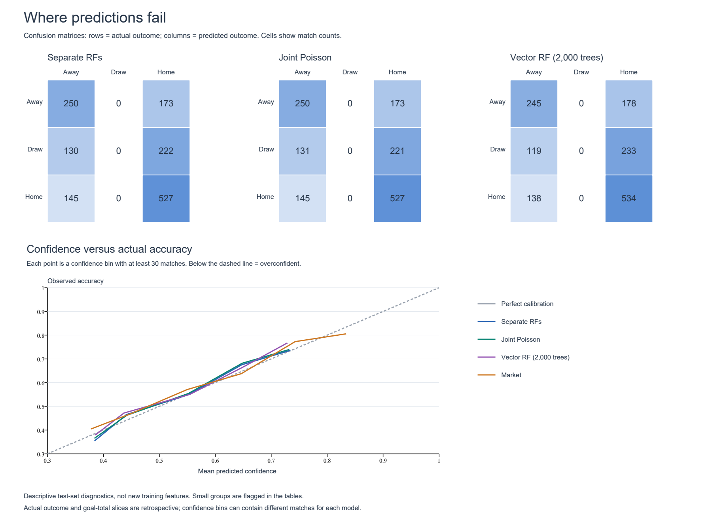

# Football score prediction and betting backtests

Predict home and away football goals, convert the score predictions into match-outcome probabilities, and compare betting decision rules on recorded odds.

The current experiment compares two separate random forests, a single **2,000-tree multi-output random forest**, and a bivariate Poisson calibration layer. It also examines where predictions fail and whether probability-based betting rules produce positive historical returns.

## Start here

### Live predictions and local interface

The live workflow downloads expected/confirmed lineups from RotoWire, current EA
overall ratings, and results/Bet365 odds from Football-Data. It feeds lineup rating
summaries and pre-match form into the **existing 2,000-tree random forest** and
exports home/draw/away probabilities and goal counts. No API key is required.
See [integration details and limitations](docs/live-lineup-integration.md).

```bash
# Launch the interface, then open http://127.0.0.1:8765
python -m pip install -r requirements-live.txt
python run.py app

# Or collect data and predict directly from the command line
python run.py predict
python run.py predict --model lineup_rf --leagues E0 SP1 --days 14

# Repeat using already downloaded source files
python run.py predict --offline

# Check parsing, date isolation, probabilities, and exports without network access
python scripts/test_live_predictions.py
python scripts/test_lineup_integration.py
```

Choose leagues and click **Refresh & predict** in the interface. Supported leagues:
Premier League (`E0`), La Liga (`SP1`), Bundesliga (`D1`), Serie A (`I1`), and Ligue 1
(`F1`). Outputs and source caches are saved under `results/live/`; the interface
can reload the last successful run. Stop the server with Ctrl+C. Use `--port 8766`
if the default port is occupied. Run one pipeline at a time against this directory.

**Strategy selections** compares all 14 existing backtest rules, including the
binary home-win/home-loss and home-or-skip rules. Choose a rule or **All strategies**
to see its selection, decimal odds, actual model probability, expected net profit
per unit, and stake split. Synthetic double-chance prices are explicitly labeled.
Missing odds produce **Unavailable**; threshold failures produce **Skip**. Each
strategy is an alternative, and one unit means one total stake per match. This
does not place bets. Export all rows using **Download all strategy selections**.
To add strategies to an existing saved run without downloading again, execute
`python src/live_bets.py`. Validate the rules with `python scripts/test_live_bets.py`.

The default **Lineups + EA ratings** mode requires 22 uniquely matched starters,
Bet365 odds, and the saved model with matching training metadata. It withholds
fixtures with missing inputs, shows their reasons, and exposes each predicted
XI and its ratings. Matchweeks may be explicitly labeled estimates; official
overrides are supported. Predicted lineups and current launch ratings are not
identical to the historical model's training inputs, so live accuracy is unverified.

The optional **results-only Poisson baseline** remains available with
`python run.py predict --model poisson`. This mode needs only the standard library.
It uses home/away scoring and conceding rates, exponentially weighted with a
180-day half-life and shrunk toward league averages using eight pseudo-matches.
It needs no FIFA ratings, injuries, lineups, or odds. The interface reports
walk-forward accuracy and log loss on up to 60 recent matches per league, with
a league-average Poisson comparator. At least 100 earlier matches are required
for evaluation. These checks do not establish that the model is profitable or
better than the existing forest.

Only fixtures supplied by the provider can be predicted; its CSV is a limited
upcoming list, not the entire future season. An empty list is reported explicitly.
Dates use the current UTC date, source times are displayed verbatim, and today's
fixtures may already have started. Training excludes today's results. Historical
files for the requested seasons must all download successfully; failures do not
silently substitute stale cache files. Offline mode explicitly uses cached files.
Source timestamps and hashes are stored in `predictions.json`. Small team samples
are flagged. The modal score and expected goal counts are different quantities;
predicted goal counts are not shot-based xG.

- [Main notebook](notebooks/prediction_bivariate.ipynb): saved results, model code, plots, and error analysis.
- [HTML report](results/report.html): download and open locally with the other files in `results/`; GitHub displays its source.
- [Model metrics](results/model_metrics.csv) and [strategy results](results/strategy_results.csv).
- [Methodology and limitations](docs/methodology.md).



## Current experiment

The existing split contains **11,561 usable training matches** and **1,447 test matches** after removing seven incomplete training rows. All models use the same test matches. The vector forest uses squared-error loss, 2,000 trees, depth 5, `max_features=0.3`, and `max_samples=0.5`.

| Model | Correct outcomes | Accuracy | Outcome log loss ↓ |
|---|---:|---:|---:|
| Separate random forests | 777 / 1,447 | 53.70% | 0.97879 |
| Bivariate Poisson, exact probabilities | 777 / 1,447 | 53.70% | 0.97883 |
| Single vector-output forest | 779 / 1,447 | 53.84% | 0.97884 |

The RF-based models never select a draw as their most likely outcome in this test set, despite assigning nonzero draw probabilities. Closely matched teams are also harder to predict. The notebook includes confusion matrices, calibration, team-level errors, goal errors, and individual wrong predictions.

### Betting results are exploratory

Each backtest stakes one unit per match unless the rule explicitly skips a bet. Reported profit is net of the stake. For the vector forest:

| Binary decision rule | Most-likely-side profit | Square-root-profit-weighted profit |
|---|---:|---:|
| Home wins vs. does not win | −75.32 units | +78.44 units |
| Home loses vs. does not lose | −62.62 units | −188.93 units |

Square-root-profit weighting chooses the largest `probability × sqrt(decimal_odds − 1)`. Double-chance payouts are **synthetic split-stake payouts**, not quoted market prices. A synthetic payout at or below one receives zero weight in that rule.

These strategies were explored repeatedly on the same test set. Positive returns are not independent confirmation of a profitable strategy. A fresh, chronologically held-out evaluation is needed before making that claim.

## Setup

Use **Python 3.12**. From the repository root:

```bash
python -m venv .venv
# Windows PowerShell:
.venv\Scripts\Activate.ps1
# macOS/Linux instead: source .venv/bin/activate
python -m pip install -r requirements.txt
```

To open notebooks interactively:

```bash
python -m pip install -r requirements-notebooks.txt
python -m jupyter lab
```

Open `notebooks/prediction_bivariate.ipynb`. Its embedded outputs can also be viewed on GitHub without installing anything. The saved model binary is optional: when absent, the notebook displays committed per-match predictions unless you explicitly choose to retrain.

## Reproduce

```bash
# Rebuild tables, plots, report, and notebook from saved predictions; no training:
python run.py report

# Refit models on data/train.csv and evaluate data/test.csv, then rebuild the report:
python run.py train

# Check Python/notebook syntax, probabilities, metrics, and strategy accounting:
python run.py check
```

The report command reconstructs the ignored betting ledgers from `results/match_predictions.csv`. The train command writes a local `results/vector_forest.joblib`; the model and detailed ledgers are intentionally ignored by Git. The report command does **not** evaluate newly edited model code—run `train` for that.

## Repository layout

```text
data/                 Existing CSV inputs and historical league tables
docs/                 Methodology, data notes, and legacy workflow notes
models/legacy/        Original saved estimators and encoders
notebooks/
  prediction_bivariate.ipynb   Current experiment
  legacy/             Original exploratory notebooks
results/              Curated metrics, predictions, figures, and report
scripts/              Project verification
src/                  Training, evaluation, reporting, and shared helpers
run.py                Train / report / check entry point
requirements.txt      Current workflow dependencies
```

Historical data and model files were preserved during cleanup. The repository still contains about 152 MB of pre-existing tracked material; restructuring does not reduce Git history. See [data notes](docs/data.md) before redistributing the datasets, and [legacy notes](docs/legacy.md) before running older notebooks. No software or dataset license has been selected by this cleanup.
# Five-level dollar staking

The interface adds a separate staking gate to all 14 original selections: skip
nonpositive model expected value, then rank positive selections by the Kelly score
`(probability * odds - 1) / (odds - 1)`. Fixed score bands `(0,1%]`, `(1%,2%]`,
`(2%,3%]`, `(3%,4%]`, and `>4%` map to $1, $2, $3, $4, and $5 total per match.
These are ranking bands, not percentages of a bankroll. Amounts can be edited in
the interface; edits affect the displayed live and historical dollar amounts only.
CSV exports retain the default $1–$5 amounts. Synthetic legs split the total stake.

Run `python scripts/backtest_stake_levels.py` to rebuild season/level summaries and
the full ledger in `results/stake_level_*`. Training results use the saved vector
forest's out-of-bag predictions; test results use held-out `RF_vector` predictions.
OOB is not a chronological walk-forward evaluation. Historical inputs use actual
lineups and differ from live projected lineups. Season labels are uniquely matched
to source season tables; unmatched or ambiguous model rows stop the build.
The fixed thresholds are not selected to maximize historical profits.

The history panel reports total stakes, gross returns (including returned stakes),
net profits, ROI, and the original flat-$1 strategy comparison. This is hypothetical
accounting with no compounding, bankroll limit, fees, or cent rounding of synthetic
legs. The project has already inspected its test set in previous analyses.
Check boundaries and reconcile every ledger row with the summaries using
`python scripts/test_stake_levels.py`.

Historical charts in the interface follow the selected strategy and edited dollar
stakes. Select All strategies to compare train/test ROI, or a single strategy for
season net profits. Run `python scripts/plot_stake_history.py` after rebuilding the
backtest to export the default $1–$5 figures as `results/stake_history_*.png` and
SVG. Exported figures use the saved amounts, not unsaved browser edits.

Run `python scripts/plot_stake_cumulative.py` after rebuilding the backtest to
generate cumulative profit curves for all strategies and the exported
`results/stake_cumulative_profit.png`. Each curve starts at zero and settles
all bets within each season/matchweek together. Exact kickoff dates are absent,
so these are matchweek-ordered profit curves, not daily bankroll histories.
The builder verifies all 28 final curve values against the historical summaries.

## Fixed-model strategy search

`python scripts/search_betting_strategies.py` searches 2,240 flat-stake combinations
of 14 existing rules, raw/logistic-calibrated probabilities, five minimum edges,
four odds bands, and four outcome filters. Calibration uses 2014–18 OOB rows;
selection uses 2018–20; 2020–22 is an audit period; previously inspected 2022–23
test results are reported separately. Shortlisted flat rules also test three
Kelly band widths (1%, 2.5%, 5%) with $1–$5 stakes. No live settings change.

This isolates strategy selection using the saved model. Its OOB trees still
contain later training seasons: it is **not** a leakage-free chronological
model backtest. Search winners may fail on later periods. The HTML report at
`/strategy-search`, JSON, full search CSV and finalist CSV are written under
`results/strategy_search*`. Run `python scripts/test_strategy_search.py` to audit
selection independence from holdout metrics and reconcile period accounting.
